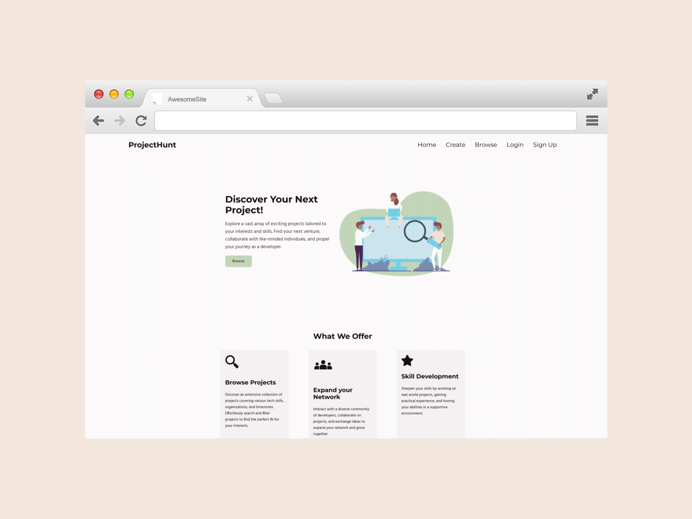

<div align="center">


  
  <h1>ProjectHunt</h1>
  
  <p>
    Your go-to platform for discovering, collaborating on, and enhancing your skills through exciting coding projects!
  </p>
  
  
<!-- Badges -->
<p>
  <a href="https://github.com/Louis3797/awesome-readme-template/graphs/contributors">
    
  </a>
  <a href="">
    
  </a>
  <a href="https://github.com/ImanKahlila/ProjectHunt/network/members">
    
  </a>
  <a href="https://github.com/ImanKahlila/ProjectHunt/stargazers">
    
  </a>
  <a href="https://github.com/ImanKahlila/ProjectHunt/issues/">
    
  </a>
  <a href="https://github.com/ImanKahlila/ProjectHunt/blob/master/LICENSE">
    
  </a>
</p>
   
<h4>
    <a href="https://github.com/ImanKahlila/ProjectHunt/">View Demo</a>
  <span> · </span>
    <a href="https://github.com/ImanKahlila/ProjectHunt">Documentation</a>
  <span> · </span>
    <a href="https://github.com/ImanKahlila/ProjectHunt/issues/">Report Bug</a>
  <span> · </span>
    <a href="https://github.com/ImanKahlila/ProjectHunt/issues/">Request Feature</a>
  </h4>
</div>

<br />

<!-- Table of Contents -->
# Table of Contents

- [About the Project](#about-the-project)
  * [Screenshots](#screenshots)
  * [Tech Stack](#tech-stack)
  * [Features](#features)
  * [Color Reference](#color-reference)
  * [Environment Variables](#environment-variables)
- [Getting Started](#getting-started)
  * [Prerequisites](#prerequisites)
  * [Installation](#installation)
  * [Running Tests](#running-tests)
  * [Run Locally](#run-locally)
  * [Deployment](#deployment)
- [Usage](#usage)
- [Roadmap](#roadmap)
- [Contributing](#contributing)
  * [Code of Conduct](#code-of-conduct)
- [FAQ](#faq)
- [License](#license)
- [Contact](#contact)
- [Acknowledgements](#acknowledgements)
  

<!-- About the Project -->
## About the Project


<!-- Screenshots -->
### Screenshots

<div align="center"> 
  
</div>


<!-- TechStack -->
### Tech Stack

<details>
  <summary>Client</summary>
  <ul>
    <li><a href="https://www.javascript.com/">JavaScript</a></li>
    <li><a href="https://ejs.co/">EJS</a></li>
    <li><a href="">HTML</a></li>
    <li><a href="">CSS</a></li>
  </ul>
</details>

<details>
  <summary>Server</summary>
  <ul>
    <li><a href="https://www.javascript.com/">JavaScript</a></li>
    <li><a href="https://expressjs.com/">Express.js</a></li>
  </ul>
</details>

<details>
<summary>Database</summary>
  <ul>
    <li><a href="https://www.mongodb.com/">MongoDB</a></li>
  </ul>
</details>

<!-- Features -->
### Features

- **Project Listings**: Users can post and view project listings. Each listing includes project details such as the project name, description, skills required, and more.
- **User Profiles**: Users can create profiles with information about their skills, experience, and interests.
- **Search and Filters**: Users can search for projects or opportunities based on specific criteria like skills, project type, location, and more. Advanced filtering options make it easier to find relevant projects.

<!-- Color Reference -->
### Color Reference

| Color             | Hex                                                                |
| ----------------- | ------------------------------------------------------------------ |
| Primary Color |  #c2d5b8 |
| Secondary Color |  #f3e6dd |
| Accent Color |  #788bb0 |
| Text Color |  #1a0f13 |


<!-- Env Variables -->
### Environment Variables

To run this project, you will need to add the following environment variables to your .env file

`DB_STRING`

`DB_PASSWORD`

<!-- Getting Started -->
## Getting Started

<!-- Run Locally -->
### Run Locally

Clone the project

```bash
  git clone https://github.com/ImanKahlila/ProjectHunt.git
```

Go to the project directory

```bash
  cd ProjectHunt
```

Install dependencies

```bash
  npm install
```

Setup config.env file <a href="https://github.com/ImanKahlila/ProjectHunt/blob/79-add-configenv-instructions-to-readme/DBconfig.md">Details Here</a>


Start the server

```bash
  npm start
```


<!-- Roadmap -->
## Roadmap

* [ ] Social Media Login
* [ ] Messaging


<!-- Contributing -->
## Contributing

<a href="https://github.com/Louis3797/awesome-readme-template/graphs/contributors">
  
</a>


Contributions are always welcome!

See `contributing.md` for ways to get started.


<!-- Code of Conduct -->
### Code of Conduct

Please read the [Code of Conduct](https://github.com/Louis3797/awesome-readme-template/blob/master/CODE_OF_CONDUCT.md)

<!-- FAQ -->
## FAQ

- What is ProjectHunt?

  + ProjectHunt is a dynamic web platform founded by a group of developers who honed their coding skills through the 100Devs agency. Our mission is to empower developers, like you, by providing a space where you can effortlessly discover projects that align with your aspirations. Whether you're a seasoned pro or just starting your coding journey, ProjectHunt is designed to help you find exciting projects to work on and connect with like-minded individuals.

- What Sets ProjectHunt Apart from Other Project Discovery Platforms?

  + What truly sets ProjectHunt apart is our relentless focus on filtering and search capabilities. We understand that finding the right project can be a daunting task, especially with so many options out there. That's why we've put a significant emphasis on making the project discovery process as efficient as possible. Our platform allows you to filter projects by technology skills, organizations, timezones, and more. This means you can quickly zero in on projects that match your interests and skillset, saving you valuable time and effort.

- Can I Use ProjectHunt for Free?

  + Absolutely! ProjectHunt is and will always be a free platform. We believe that access to opportunities and a vibrant community of developers should be open to everyone. There are no hidden costs or premium features that require payment. Our commitment is to provide you with a free, user-friendly, and feature-rich platform to enhance your development journey.


<!-- License -->
## License

Distributed under the no License. See LICENSE.txt for more information.


<!-- Contact -->
## Contact
- https://github.com/ImanKahlila
- https://github.com/ThomasCarney315
- https://github.com/andrewquach-dev
- https://github.com/IreneLinWasHere


<!-- Acknowledgments -->
## Acknowledgements

 - [Shields.io](https://shields.io/)
 - [Awesome README](https://github.com/matiassingers/awesome-readme)
 - [Emoji Cheat Sheet](https://github.com/ikatyang/emoji-cheat-sheet/blob/master/README.md#travel--places)
 - [Readme Template](https://github.com/othneildrew/Best-README-Template)
